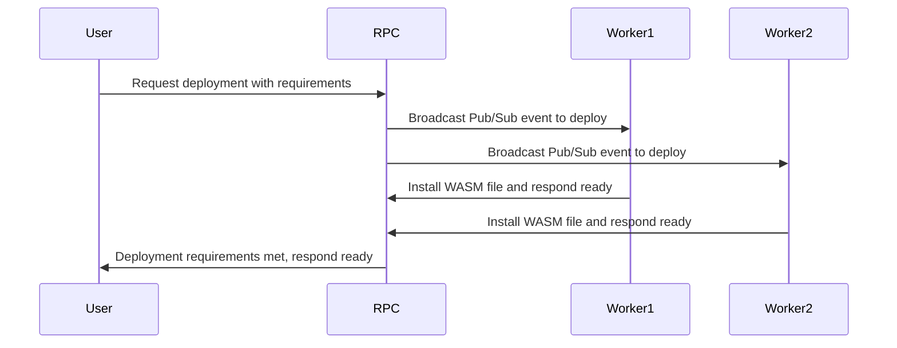

```mermaid
sequenceDiagram
    participant User
    participant RPC
    participant Worker1
    participant Worker2
    User->>RPC: Request deployment with requirements
    RPC->>Worker1: Broadcast Pub/Sub event to deploy
    RPC->>Worker2: Broadcast Pub/Sub event to deploy
    Worker1->>RPC: Install WASM file and respond ready
    Worker2->>RPC: Install WASM file and respond ready
    RPC->>User: Deployment requirements met, respond ready
```
