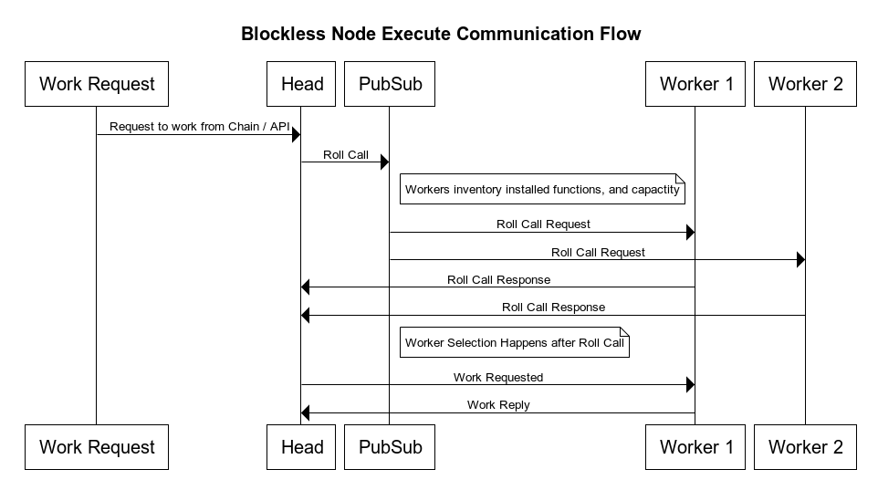

```text
title Blockless Node Execute Communication Flow
Work Request->Head: Request to work from Chain / API
Head->PubSub: Roll Call
note right of PubSub: Workers inventory installed functions, and capactity
PubSub->Worker 1: Roll Call Request
PubSub->Worker 2: Roll Call Request
Worker 1->Head: Roll Call Response
Worker 2->Head: Roll Call Response
note right of PubSub: Worker Selection Happens after Roll Call
Head -> Worker 1: Work Requested
Worker 1 -> Head: Work Reply
```
